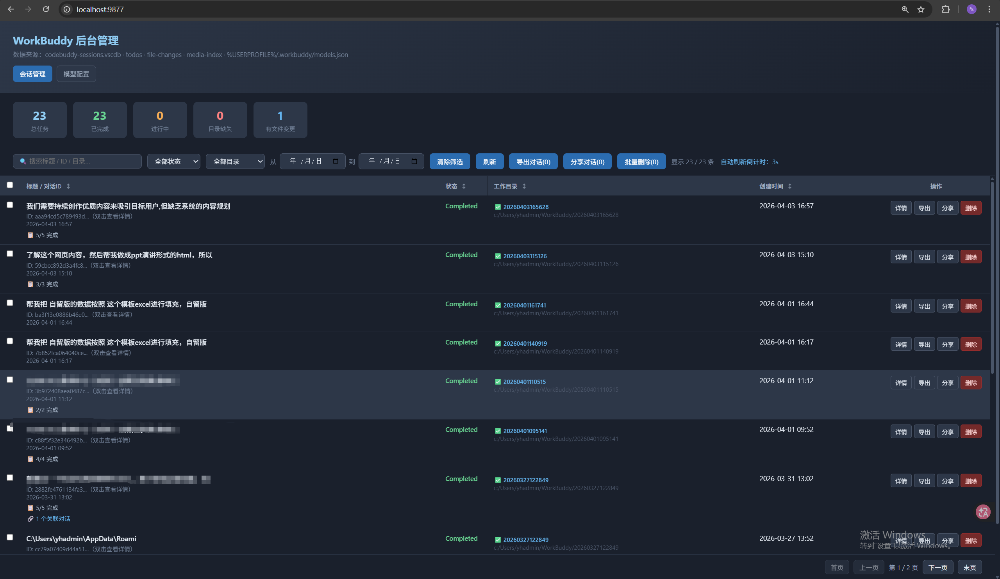

# WorkBuddy 会话管理器 — 界面功能说明

> 本文档介绍各界面功能的使用方式，包含截图与操作演示。

---

## 目录

- [1. 主页](#1-主页)
- [2. 会话详情](#2-会话详情)
- [3. 导出](#3-导出)
- [4. 分享](#4-分享)
- [5. 删除](#5-删除)
- [6. 工作空间](#6-工作空间)
- [7. 管理配置](#7-管理配置)

---

## 1. 主页

**功能说明：**

提供会话管理和模型配置、搜索筛选、导出和分享对话、删除等功能

**截图：**

---

## 2. 会话详情

**功能说明：**

提供了基本信息、对话（聊天记录）、Todos、文件变更、关联对话、媒体文件、工作目录文件等内容查看

**截图：**

基础对话：只展示基础对话，不展示工具调用详情

完整对话：提供了完整对话参数和工具调用详情

媒体文件：workbuddy的产物结果，支持直接打开和定位文件功能

工作目录文件：workbuddy的工作目录，过程处理文件，支持直接打开和定位文件功能

---

## 3. 导出

**功能说明：**

支持批量会话导出和单会话导出，支持导出选择媒体文件和自上传媒体文件，导出后为压缩包文件，需要解压，加压后用浏览器打开目录里的index.html即可。

**截图：**

导出配置：

批量导出多会话界面：

单会话导出界面：

---

## 4. 分享

**功能说明：**

支持多会话和单会话分享，界面与导出一致，分享支持选择和自行上传分享媒体文件。

**截图：**

分享配置：

分享操作：本地是使用ngrok穿透技术，所以首访问需要点击“Visit Site”

批量分享多会话界面：

单会话分享界面：

---

## 5. 删除

**功能说明：**

由于workbuddy现版本不支持删除会话功能，导致会有冗余对话存在，该后台可以对会话进行删除。

注意：删除后需要重新打开workbuddy客户端

**截图：**

删除配置：

---

## 6. 工作空间

**功能说明：**

与会话管理界面不同，该界面是以工作目录为主展开的展示，并且可对工作目录直接进行删除（需要删除完整对话）
注意：删除后需要重新打开workbuddy客户端

**截图：**

---

## 6. 管理配置

**功能说明：**

管理人员专用界面，只有使用管理启动服务和浏览器带有admin=true参数才会展示出这个功能，目前只有对话内容上传功能，用于采集普通人员机器上的对话内容上传到指定服务器。

操作流程：上传配置-初始化数据-启动监控

**截图：**

本机信息：展示当前人员机器信息

---